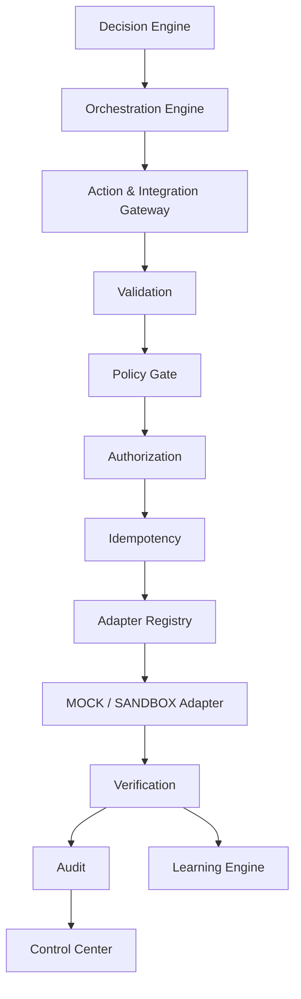

# Action Gateway Architecture

```mermaid
flowchart TD
 D[Decision Engine] --> O[Orchestration Engine]
 O --> G[Action & Integration Gateway]
 G --> V[Validation]
 V --> P[Policy Gate]
 P --> A[Authorization]
 A --> I[Idempotency]
 I --> R[Adapter Registry]
 R --> X[MOCK / SANDBOX Adapter]
 X --> Q[Verification]
 Q --> U[Audit]
 U --> C[Control Center]
 Q --> L[Learning Engine]
```

Every external action requires Decision + Policy + Authorization + Adapter + Verification.
