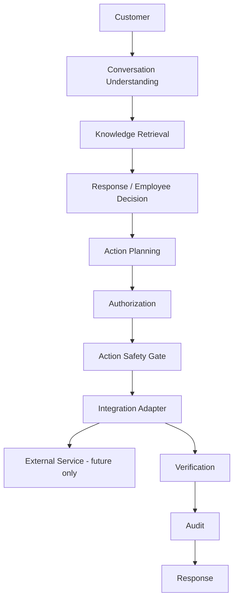

# Action & Integration Architecture

```mermaid
flowchart TD
Customer --> CU[Conversation Understanding]
CU --> KR[Knowledge Retrieval]
KR --> ED[Response / Employee Decision]
ED --> AP[Action Planning]
AP --> AU[Authorization]
AU --> SG[Action Safety Gate]
SG --> IA[Integration Adapter]
IA --> ES[External Service - future only]
IA --> VF[Verification]
VF --> AUDIT[Audit]
AUDIT --> RESP[Response]
```

External services are NOT connected in Phase 10. The adapter boundary prevents provider-specific API details from entering Core Intelligence.