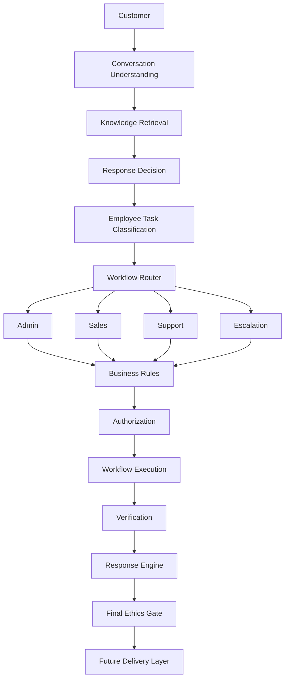

# AI Employee Architecture

AI Model ≠ Business Logic. AI Model ≠ Ethics Authority. AI Model ≠ Business Rule Authority. The model is an intelligence component inside the controlled system. Provider Layer remains separate from Workflow Engine.