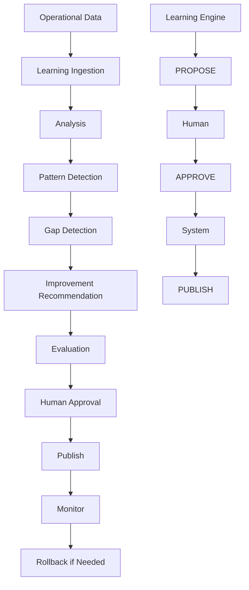

# AI Employee Learning Architecture

The Learning Engine is proposal-only. Human approval is an authority boundary, not a suggestion. Ethics and safety gates remain outside learning authority and cannot be modified by learning output.
