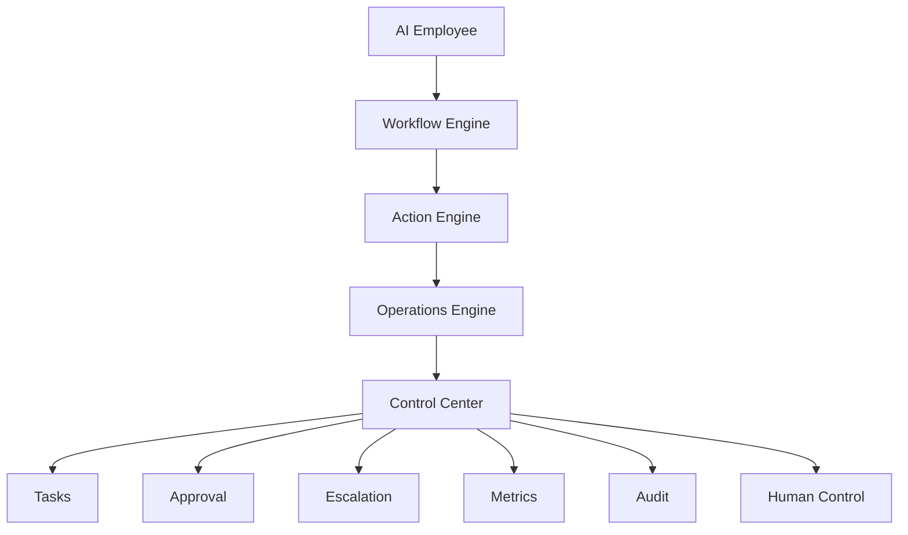

# AI Employee Operations Architecture

```mermaid
flowchart TD
A[AI Employee] --> B[Workflow Engine] --> C[Action Engine] --> D[Operations Engine] --> E[Control Center]
E --> T[Tasks]
E --> P[Approval]
E --> X[Escalation]
E --> M[Metrics]
E --> U[Audit]
E --> H[Human Control]
```

Human is final authority for high-risk actions, policy changes, financial actions, legal commitments, security incidents and critical escalations.