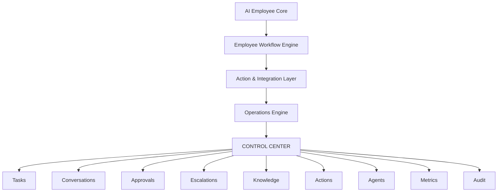

# Control Center Architecture

The Control Center is an observability/control layer, not an intelligence layer. It cannot bypass Ethics, Knowledge Trust, Privacy, Safety, Authorization, or Human Approval. Phase 11 uses synthetic/mock data only.