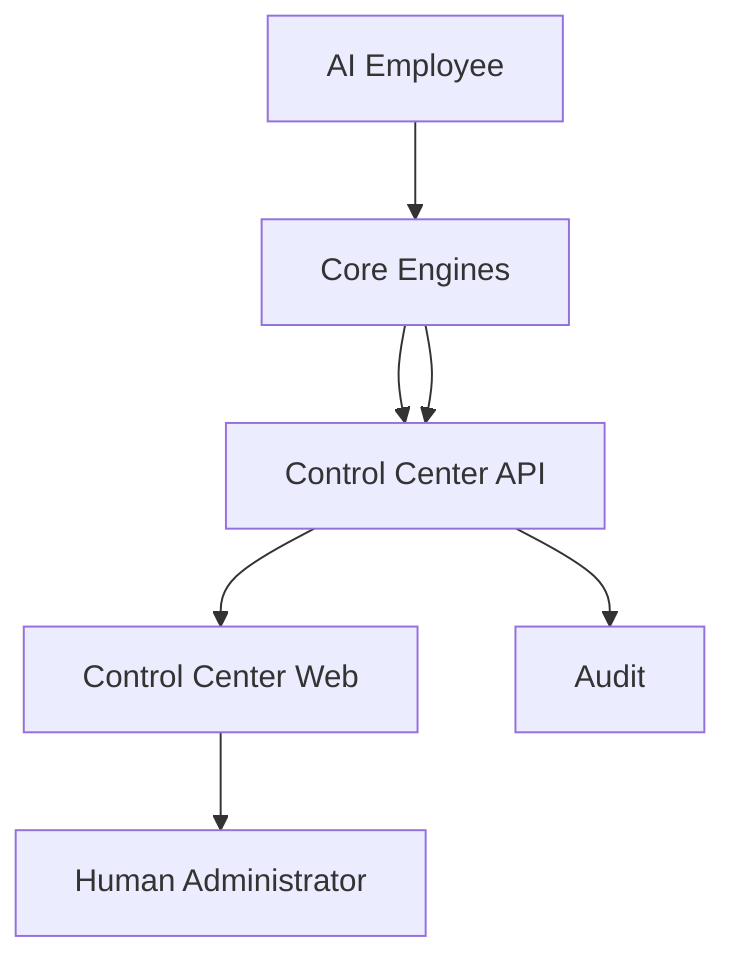

# Control Center Architecture

The Control Center is the control plane, not the AI brain. It observes Conversation, Knowledge, Decision, Orchestration, Action, Learning, Customer, Sales, and Support state. Critical mutations require authorized human control.
