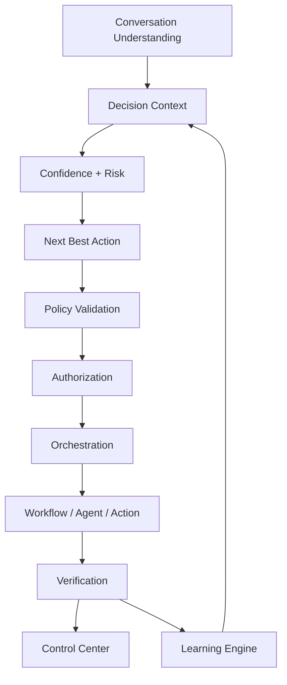

# Decision Architecture

```mermaid
flowchart TD
A[Conversation Understanding] --> B[Decision Context]
B --> C[Confidence + Risk]
C --> D[Next Best Action]
D --> E[Policy Validation]
E --> F[Authorization]
F --> G[Orchestration]
G --> H[Workflow / Agent / Action]
H --> I[Verification]
I --> J[Control Center]
I --> K[Learning Engine]
K --> B
```

Decision chooses; policy constrains; authorization permits; orchestration coordinates; verification confirms.